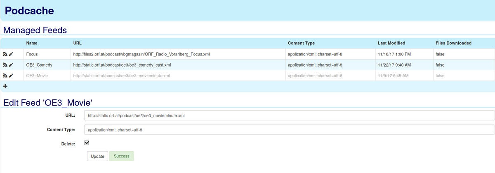

# PodCache
Provide access to podcast episodes. Possibly forever.

---

## Purpose
Podcache was created for a very specific use case: It provides means to access podcast episodes for an unlimited time, even if they have already been removed from the original podcast XML. This is intended for users that aren't tech-savvy and do not use their personal computers often but still want to be able to access a Podcast's episodes a while later. 

Another goal of this application is that there needs to be as little change for the end-user as possible (i.e. no need to learn yet another application, etc.). 

### How does it work
Podcache is run as a small service that lives between the original feed and a user's podcatcher. Feeds are updated automatically and all files are downloaded automatically. It then provides provides it's own feeds to users, consisting of all collected episodes so far. The only thing that changes for the end user is the feed's URL.

## Application Setup
Podcatcher consists of a single, complete binary, an executable JAR file. Make sure to read and customize the following settings prior to running the application. To apply these, create a file called "application.yaml" next to the JAR file.

### Server Address
The default settings will provide URLs for `localhost` only. This means that you will only ever be able to access your feeds from another machine.

To change this behavior, add the following line to the settings file:

```yaml
server.address: HOST_NAME
```

Replace `HOST_NAME` with either your server's host name or IP address.

### Server Port
The application will use the port 7332 by default.

To change this, you add the following line to the setting file:

```yaml
server.port: 8080
```

### Directories holding data
The default setting will cause for both the database files as well as all feed files to be stored in the directory "podcache" relative to the directory you've run the application in.

You can change this behavior by adding the following configuration:

```yaml
podcache.data.directory: /usr/share/podcache
```

### Update interval
Feeds are updated once a day at 1 AM. You can configure the interval via the settings file:

```yaml
podcache.update.interval: "0 1 0 * * ?"
```

Read the documentation on Cron for possible values. Put the value between quotes if necessary.

### Debugging
If you stumble upon an unexpected behavior you can increase the logging output using the following setting:  

```yaml
logging.level.at.dire: DEBUG
```

You can also launch the application with the ``--debug`` option, which will output even more information, including Spring internal logging.


To help reporting issues, you can also redirect all logging to a log file: 

```yaml
logging.file: /tmp/podcache.log
```

## Running the application
Place the service's JAR file into any directory, add the configuration and then execute the JAR: 

```sh
java -jar podcache-x.y.z.jar
```

Once the application is started, you can access the application through your web browser:

```
http://localhost:7332/
```



Use this web interface to add new feeds. Feeds will be automatically updated once a day as long as the application is running. Also note that the podcast files are only updated once a day as well.

Click the RSS icon on the web frontend to get a feed's URL that you can then add to a podcatcher of your choosing.

## Implementation Details
### Components Used
The following components are used to implement the service backend and a simple web frontend.

* Java 8
* Spring Framework ([SpringBoot](http://projects.spring.io/spring-boot), [Spring Data JPA](http://projects.spring.io/spring-data-jpa))
* [HSQLDB](http://hsqldb.org)
* [RomeTools](https://rometools.github.io/rome)
* [Apache HTTPClient](https://hc.apache.org/httpcomponents-client-ga)
* [Checker Framework](https://checkerframework.org)
* [AngularJS](https://angularjs.org)
* [Bootstrap CSS](https://getbootstrap.com/docs/3.3/css)
* [OpenIconic](https://useiconic.com/open)

### Building the Application
Podcache is implemented as a small Maven Project using the `spring-boot-maven-plugin`. The final JAR file is created through Maven on build.

## Comparable tools
None that I know of.

## How to contribute
Please feel free to report issues or suggest and share improvement. Criticism is also welcome. 
